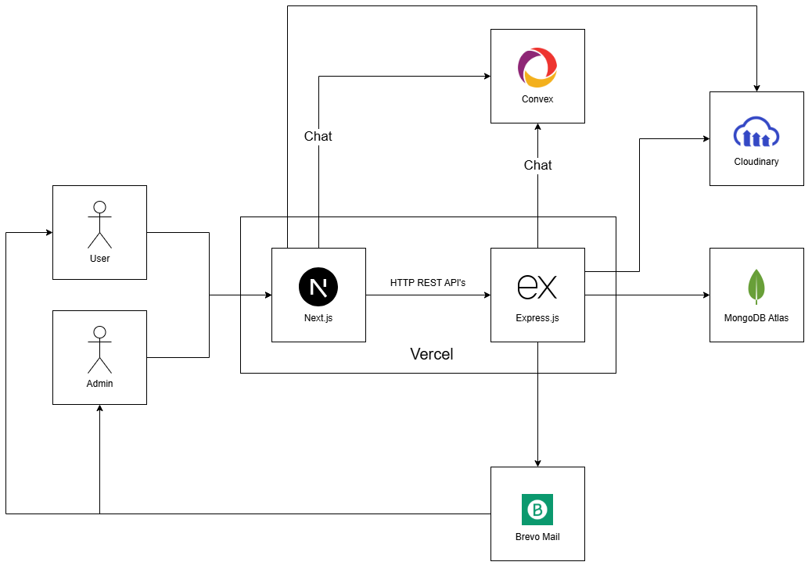

# BroML

**BroML** is an exclusive social networking platform built for technology
professionals. It brings together professional networking, technical content
sharing, and community events in a single product — enabling users to build
their network, showcase their technical work, discover opportunities, and book
tech events directly through organization and business pages.

---

## Table of Contents

- [Overview](#overview)
- [Core Features](#core-features)
- [Non-Functional Requirements](#non-functional-requirements)
- [System Architecture](#system-architecture)
- [Tech Stack](#tech-stack)
- [Repository](#repository)

---

## Overview

BroML is designed as a focused, professional alternative to general-purpose
social networks — one built specifically around the needs of the tech community.
Rather than treating networking, content, and events as separate concerns, BroML
unifies them:

- **Professional identity** — profiles built around real technical work (GitHub
  repos, Hugging Face projects, certifications, achievements).
- **Content & discovery** — a personalized feed that surfaces relevant technical
  content based on interests and engagement.
- **Organizations & events** — business/organization pages that host verified
  tech events, with end-to-end booking and check-in details.
- **Real-time communication** — direct, encrypted chat between users.

---

## Core Features

### Authentication & Account

- Sign up via email/password or Google OAuth.
- Unique username per account.
- One account per email address.

### Profile Management

- Fully customizable user profiles.
- Showcase technical work as part of a personal brand — GitHub repositories,
  Hugging Face projects, certifications, and achievements.

### Networking

- Connect with other users.
- Follow organization/business pages.

### Pages

- Create and delete pages (organizations/businesses).
- Maximum of 5 pages per account.

### Posts & Content

- Create and delete posts.
- Like, comment, and share posts.
- Share stories.
- Personalized content feed driven by user interests and engagement history.

### Events

- Book and confirm attendance for events published by pages.
- Receive booking confirmations with all entry details (ticket/QR code, venue,
  date & time, prerequisites).
- All events are reviewed and verified by an admin/moderator before going
  public.

### Communication

- One-to-one chat between users.

### Search

- Search across users, pages, posts, and events.

### Notifications

- Real-time alerts for connection requests, post interactions, chat messages,
  and event reminders.

---

## Non-Functional Requirements

| Category                      | Requirement                                                                                                                                                                              |
| ----------------------------- | ---------------------------------------------------------------------------------------------------------------------------------------------------------------------------------------- |
| **Scalability**               | Scales within the limits of current free-tier infrastructure; once capacity is reached, new signups enter a waiting period.                                                              |
| **Availability**              | Favors availability over strict consistency (per the CAP theorem) — an eventually-consistent, always-available system. Target uptime: **99.5%**.                                         |
| **Performance**               | Search results, feed content, and chat messages return within 1–2 seconds under normal load.                                                                                             |
| **Security**                  | End-to-end encrypted chat; sensitive data (passwords, personal details) encrypted at rest and in transit; rate limiting and abuse detection against spam, bots, and brute-force attacks. |
| **Reliability**               | Regular automated backups and a defined disaster recovery plan.                                                                                                                          |
| **Usability & Accessibility** | Fully responsive across mobile, tablet, and desktop.                                                                                                                                     |
| **Maintainability**           | Modular codebase and infrastructure, allowing independent scaling and updates of services such as chat, notifications, and search.                                                       |

---

## System Architecture

**Flow summary:**

- **Users** and **Admins** interact with the platform through a **Next.js**
  frontend.
- Next.js communicates with an **Express.js** backend via HTTP REST APIs, both
  hosted on **Vercel**.
- Real-time chat is handled through **Convex**.
- Express.js integrates with:
  - **MongoDB Atlas** for persistent data storage.
  - **Cloudinary** for media/asset storage.
  - **Brevo Mail** for transactional and notification emails.
- Admin actions (e.g., event verification) flow back through the same pipeline
  to reach the Admin interface.

---

## Tech Stack

- **Frontend:** Next.js
- **Backend:** Express.js
- **Real-time Chat:** Convex
- **Database:** MongoDB Atlas
- **Media Storage:** Cloudinary
- **Email Service:** Brevo Mail
- **Hosting:** Vercel

---

## Noton

Full case study:
https://yash-ag-online.notion.site/BroML-Case-Study-395a6c0038758059a699d2a4388e49c0?pvs=74

This case study documents the complete journey of developing BroML, an exclusive
social networking platform designed for technology professionals.
